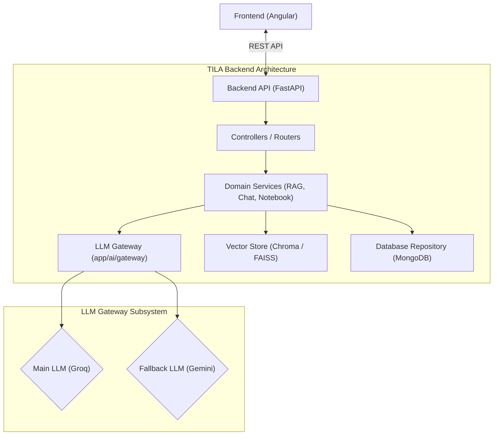

# TILA Architecture & Technical Specification

## 1. Executive Summary

TILA (Teaching & Intelligent Learning Assistant) is built as a scalable, modular AI learning platform designed to ingest educational materials, generate semantic embeddings, perform Retrieval-Augmented Generation (RAG), and deliver AI-powered tutoring capabilities.

The architecture emphasizes **Clean Architecture**, **SOLID principles**, and strict separation between domain logic, data storage, and external AI service providers.

---

## 2. High-Level Architecture Overview



---

## 3. LLM Gateway Subsystem Architecture

The **LLM Gateway** (`app/ai/gateway`) is the dedicated internal application gateway responsible for brokering all app-to-LLM communications. It ensures high availability, automatic error recovery, provider decoupling, and full observability.

### 3.1 Design Patterns

- **Adapter Pattern**: Wraps provider-specific APIs (Groq, Gemini, OpenAI) into a uniform interface (`LLMProvider`) that accepts standard `LLMRequest` objects and returns normalized `LLMResponse` objects.
- **Strategy Pattern**: Decouples the application logic from specific LLM models. Providers are dynamically selected at runtime using `LLMProviderFactory`.

---

### 3.2 Gateway Directory Structure

```text
app/ai/gateway/
├── __init__.py          # Package exports
├── config.py            # Gateway timeout, retry, and environment config
├── exceptions.py        # Gateway exception hierarchy
├── router.py            # /llm test endpoint router
│
├── interfaces/
│   ├── __init__.py
│   └── llm_provider.py  # Abstract LLMProvider interface
│
├── models/
│   ├── __init__.py
│   ├── request.py       # Normalized LLMRequest
│   └── response.py      # Normalized LLMResponse & LLMAttemptLog
│
├── providers/           # Provider adapters
│   ├── __init__.py
│   ├── groq/
│   │   ├── __init__.py
│   │   └── provider.py  # Groq API Adapter
│   ├── gemini/
│   │   ├── __init__.py
│   │   └── provider.py  # Google Gemini API Adapter
│   └── openai/
│       ├── __init__.py
│       └── provider.py  # OpenAI API Adapter
│
├── factory/
│   ├── __init__.py
│   └── provider_factory.py # Dynamic strategy registry & lookup
│
└── services/
    ├── __init__.py
    └── llm_service.py   # Central retry, timeout, and fallback service
```

---

### 3.3 Configuration Architecture

Configuration is divided into two distinct scopes:

1. **Root-Level Environment Variables (`TILA-Backend/.env`)**:
   - `MAIN_LLM_PROVIDER`: Primary LLM provider name (e.g. `groq`).
   - `MAIN_LLM_MODEL`: Primary LLM model identifier (e.g. `llama-3.3-70b-versatile`).
   - `FALLBACK_LLM_PROVIDER`: Secondary fallback provider name (e.g. `gemini`).
   - `FALLBACK_LLM_MODEL`: Secondary fallback model identifier (e.g. `gemini-1.5-flash`).
   - Secrets: `GROQ_API_KEY`, `GEMINI_API_KEY`, `OPENAI_API_KEY`.

2. **Gateway-Level Configuration (`app/ai/gateway/config.py`)**:
   - `MAIN_LLM_RETRY_COUNT`: Number of retry attempts for the main provider (default: `2` -> total 3 attempts).
   - `MAIN_LLM_RETRY_INTERVAL`: Delay between main provider retries in seconds (default: `2.0s`).
   - `MAIN_LLM_TIMEOUT`: Request timeout for main provider in seconds (default: `15.0s`).
   - `FALLBACK_LLM_RETRY_COUNT`: Number of retry attempts for fallback provider (default: `1` -> total 2 attempts).
   - `FALLBACK_LLM_RETRY_INTERVAL`: Delay between fallback provider retries in seconds (default: `2.0s`).
   - `FALLBACK_LLM_TIMEOUT`: Request timeout for fallback provider in seconds (default: `15.0s`).

---

### 3.4 Execution Flow & Resiliency Control

```mermaid
sequenceDiagram
    autonumber
    participant App as App Service / Route (/llm)
    participant GW as LLMService
    participant Main as Main Provider (Groq)
    participant Fallback as Fallback Provider (Gemini)

    App->>GW: generate(LLMRequest)
    
    loop Main Provider Retries (up to N times)
        GW->>Main: generate(LLMRequest)
        alt Success
            Main-->>GW: Normalized LLMResponse
            GW-->>App: LLMResponse (is_fallback=False)
        else Error / Timeout
            Main-->>GW: Exception
            GW->>GW: Wait MAIN_LLM_RETRY_INTERVAL
        end
    end

    Note over GW: Main Provider Exhausted. Switching to Fallback.

    loop Fallback Provider Retries (up to M times)
        GW->>Fallback: generate(LLMRequest)
        alt Success
            Fallback-->>GW: Normalized LLMResponse
            GW-->>App: LLMResponse (is_fallback=True)
        else Error / Timeout
            Fallback-->>GW: Exception
            GW->>GW: Wait FALLBACK_LLM_RETRY_INTERVAL
        end
    end

    Note over GW: All Providers Exhausted
---

### 3.5 Smart Error Classification & Resiliency

The Gateway intelligently classifies errors prior to retrying:

1. **Retryable Errors** (Transient issues where reattempting the *same* provider makes sense):
   - HTTP Status Codes: `429` (Rate Limit), `408` (Timeout), `500` (Internal Server Error), `502` (Bad Gateway), `503` (Service Unavailable), `504` (Gateway Timeout).
   - Network/Socket Errors & `LLMTimeoutError`.
   - *Behavior*: Gateway waits `RETRY_INTERVAL` seconds and retries up to configured retry limit.

2. **Permanent Errors** (Configuration or authorization flaws where retrying the *same* provider will always fail):
   - HTTP Status Codes: `400` (Bad Request), `401` (Unauthorized / Invalid Key), `403` (Forbidden), `404` (Model Not Found).
   - *Behavior*: Gateway **skips all remaining retries instantly** and immediately activates the Fallback Provider.

```mermaid
flowchart TD
    Req["LLM Request"] --> Attempt["Invoke Provider (e.g. Groq)"]
    Attempt --> ErrorCheck{"Error Occurred?"}
    ErrorCheck -- No --> Success["Return Response"]
    ErrorCheck -- Yes --> Classify{"Classify Error Type"}
    
    Classify -- "Retryable (429, 500, 503, Timeout)" --> RetryCount{"Attempts Left?"}
    RetryCount -- Yes --> Wait["Wait RETRY_INTERVAL"] --> Attempt
    RetryCount -- No --> TriggerFallback["Activate Fallback Provider"]

    Classify -- "Permanent (400, 401, 403, 404)" --> TriggerFallback
    TriggerFallback --> FallbackAttempt["Invoke Fallback Provider (e.g. Gemini)"]
```

---

### 3.5 Diagnostic Endpoint `/llm`

A dedicated test router (`app/ai/gateway/router.py`) exposes `/llm` (GET & POST) to verify LLM Gateway functionality.

**Sample Output (`POST /llm`)**:
```json
{
  "text": "Newton's second law states that F = ma...",
  "provider_used": "groq",
  "model_used": "llama-3.3-70b-versatile",
  "is_fallback": false,
  "attempts": [
    {
      "provider": "groq",
      "model": "llama-3.3-70b-versatile",
      "attempt_number": 1,
      "status": "success",
      "latency_ms": 340.5
    }
  ],
  "total_latency_ms": 340.5,
  "metadata": {}
}
```
